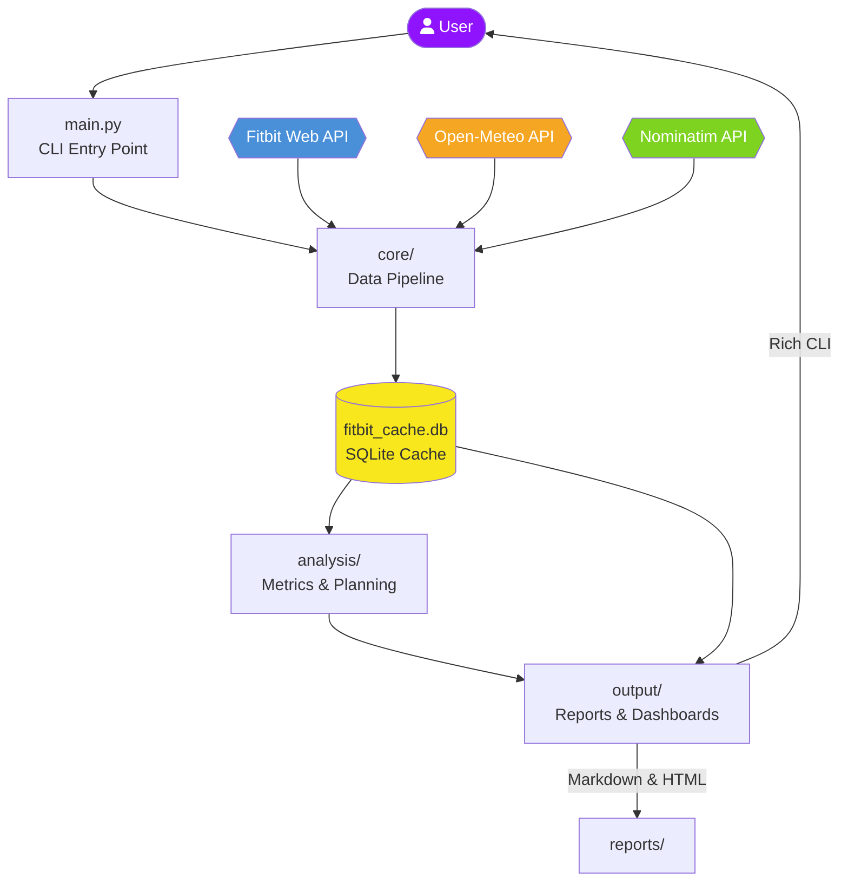
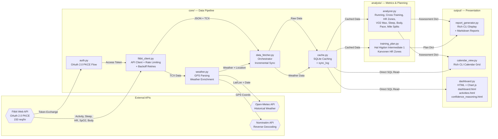
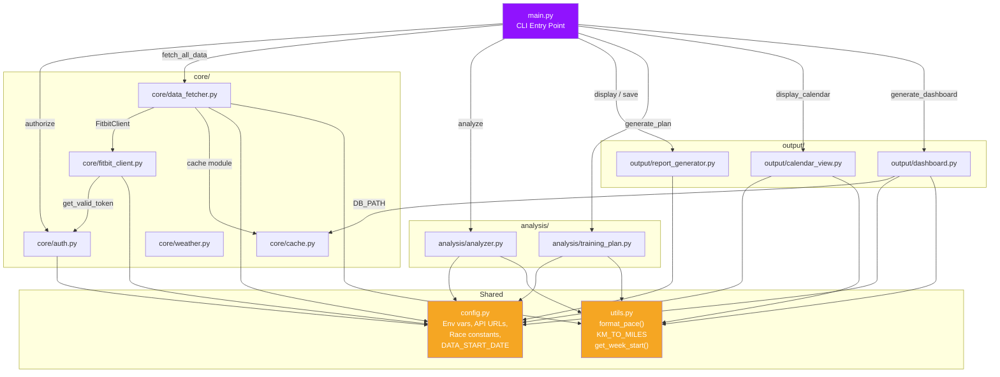

# Fitbit Race Training Tool — Architecture

A personal fitness analysis tool that pulls data from the Fitbit Web API, enriches it with weather and location context, caches everything locally in SQLite, and produces training plans, dashboards, and reports for any user-configured race goal.

---

## High-Level System Diagram



---

## Data Flow Diagram



---

## Module Dependency Diagram



---

## Folder Structure

```
fitbit-data/
├── main.py                  # CLI entry point (subcommands: setup, auth, assess, plan, progress, report, calendar, dashboard)
├── config.py                # Race config loader + environment variables
├── utils.py                 # Shared helpers: format_pace(), KM_TO_MILES, get_week_start()
├── requirements.txt         # requests, python-dotenv, rich
├── .env                     # FITBIT_CLIENT_ID, FITBIT_CLIENT_SECRET
├── .fitbit_tokens.json      # OAuth tokens (auto-generated)
├── fitbit_cache.db          # SQLite cache (auto-generated)
│
├── core/                    # Data pipeline — fetch, cache, enrich
│   ├── auth.py              # OAuth 2.0 PKCE flow + token refresh
│   ├── fitbit_client.py     # Fitbit API wrapper (rate limiting, retries)
│   ├── data_fetcher.py      # Orchestrates incremental sync across endpoints
│   ├── cache.py             # SQLite caching layer + sync_log tracking
│   └── weather.py           # TCX GPS parsing → weather + reverse geocode
│
├── analysis/                # Metrics computation and plan generation
│   ├── analyzer.py          # Fitness assessment (running, cross-training, HR, VO2 max, sleep, body, pace, splits)
│   └── training_plan.py     # Hal Higdon Intermediate 1 plan + Karvonen HR zones
│
├── output/                  # Presentation layer
│   ├── report_generator.py  # Rich CLI display + Markdown report files
│   ├── calendar_view.py     # Rich CLI month-by-month calendar grid
│   └── dashboard.py         # Standalone HTML dashboard with Chart.js
│
├── reports/                 # Generated output files
│   ├── dashboard.html       # Interactive charts dashboard
│   ├── activities.html      # Activity detail pages
│   ├── confidence_reasoning.html  # AI model reasoning table
│   └── *.md                 # Markdown assessment and plan reports
│
└── docs/                    # Documentation
    ├── architecture.md      # This file
    └── data-model.md        # SQLite schema reference for fitbit_cache.db
```

---

## Package Descriptions

### `core/` — Data Pipeline

Handles all communication with external APIs and local data persistence. The pipeline runs as: **authenticate → fetch → cache → enrich**. On first run, pulls full history back to `DATA_START_DATE` (defaults to 20 weeks before race date, configurable in `race_config.json`). On subsequent runs, performs incremental sync from the last cached date per endpoint. If the Fitbit API rate limit (150 req/hr) is hit, a module-level `_rate_limited` flag causes all remaining endpoints to gracefully fall back to cached data.

### `analysis/` — Metrics & Planning

Pure computation modules that read cached data and produce structured dicts. `analyzer.py` computes a comprehensive fitness assessment covering running stats, cross-training metrics, heart rate zones, VO2 max estimates, sleep quality, body composition, pace analysis, and mile splits. `training_plan.py` generates a week-by-week training schedule based on the Hal Higdon Intermediate 1 model, with heart rate zone targets calculated via the Karvonen method.

### `output/` — Presentation

Renders analysis results into user-facing formats. All modules consume either the analyzer's assessment dict, the training plan dict, or read directly from the SQLite cache. `report_generator.py` handles both Rich CLI terminal output and Markdown file generation. `calendar_view.py` renders a workout calendar grid. `dashboard.py` bypasses the analyzer and queries the SQLite database directly to produce standalone HTML files with embedded Chart.js visualizations, including `activities.html` for activity details and `confidence_reasoning.html` for AI model score explanations.

### `config.py` — Shared Configuration

The most-imported module in the codebase (7 dependents). Loads race goal from `race_config.json` (created by `python main.py setup`). Exports `RACE_NAME`, `RACE_DATE`, `RACE_DISTANCE_MILES`, `DATA_START_DATE`, `TARGET_TIME`, `TARGET_PACE`. Also centralizes environment variables (`FITBIT_CLIENT_ID`, `FITBIT_CLIENT_SECRET`), API base URLs, and OAuth endpoints.

### `utils.py` — Shared Utilities

Small helper functions used across packages: `format_pace()` for MM:SS/mi formatting, `KM_TO_MILES` conversion constant, and `get_week_start()` for week-based grouping. Imported by 4 modules across `core/`, `analysis/`, and `output/`.
